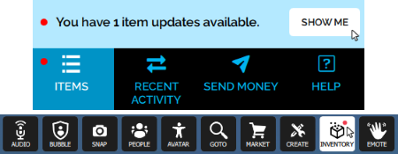

# Update Your Marketplace Item

Once you've [added an item](add-item) to sell on the Marketplace, you can update it at any time. This ability lets you offer your customers a new and improved version of your item. When an item is updated, we create a chain of related certificates between old and new versions of your item. 

**On This Page**
* [Update Your Item in the Marketplace](#update-your-item-in-the-marketplace)
* [Additional Notes](#additional-notes)

## Update Your Item in the Marketplace
All updates to your item must be reviewed, verified and certified by our Marketplace team. Once you have the new assets, you are ready to update your item. The process is similar to when you first [added your item](add-item).

1. Go to [https://highfidelity.com/marketplace/items/new](https://highfidelity.com/marketplace/items/new) to create a new item. If you're not logged in, you will be prompted to do so. 
2. Enter the name of your item and select your category. 
3. Update the metadata for your item. 
4. Click 'Save Draft'. 
5. Scroll down to the 'Updates' section. Check the box 'Updates Existing Item' and select the old version from the drop-down.
6. Scroll down to the 'Assets' section and upload your assets. 
    >>>>>Once you've created a new item and checked 'Update Existing Item', the Marketplace URL for your item will change. At this point, you need to manually edit all files that point to the URL, such as scripts and JSON files.
7. Click 'Submit for Review' to be verified and certified on the Marketplace.

Once your update is approved, a new certificate will be generated. The previous version of the item will be hidden from new customers on the Marketplace and replaced with the new version. 

## Additional Notes

1. You cannot reference existing URLs in your updates. If you create an update, you must upload all the assets the product uses, even if they remain the same. For example, if the new version of your product uses a .wav file that has not changed in the updated version, you must upload it again in the new item. This is because the certificate system needs to recertify all files used in the product together.  
2. Once the update hits the blockchain, your customers will receive notification that an updated version is available. A red dot on the Inventory icon of your Tablet or HUD indicates there is an update available on at least one Marketplace item. 
3. If a customer chooses not to update to the latest version, the old version will still be valid and listed in their Inventory.
4. Once a customer has updated an item to the latest version, they will not be able to retrieve an older version. 
5. Rezzed items will not be automatically updated to the latest version. This means that an object in-world will remain intact (as the previous version). To update a rezzed item, the customer needs to manually import the new version of the item. 
6. If a customer purchased mulitiple instances of an item, each one needs to be individually updated in their Inventory. This allows users to update one item, but leave the other ones as-is.
7. All of the above policies also apply to limited edition items.

**See Also**

+ [Add Items to the Marketplace](add-item)
+ [Ownership of Your Items](own-item)